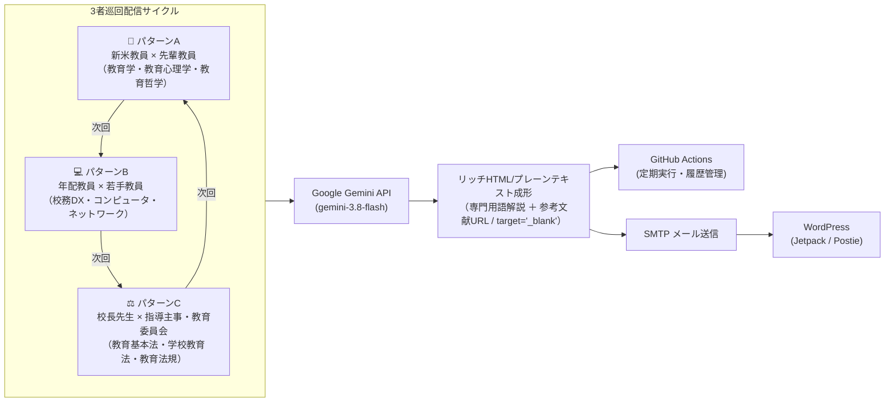

# 🏫 Solve School Problems

> **教育学の叡智、最先端テクノロジー、そして確かな学校法制の三位一体で、学校現場のあらゆる課題を鮮やかに解決する。**
> 新米教員への学術的助言（Aパターン）、年配教員を支える校務DX（Bパターン）、校長先生と教育委員会による法規判断（Cパターン）を順番（A → B → C）に自動生成し、WordPressへメール投稿するシステムです。

[](https://www.python.org/)
[](LICENSE)
[](https://github.com/features/actions)

---

## 📖 コンセプトと3つのストーリーパターン

学校教育の現場では、**「教室内の人間関係・生徒指導の悩み（教育学）」**、**「煩雑な校務事務・デジタル化の壁（校務DX）」**、そして**「重大事態・服務規律・保護者対応における適法判断（学校法制）」** という3大課題が日々発生しています。本システムは、これら3つの視点から描く短編小説を**3者巡回（A → B → C → A）で自動生成**し、WordPressブログ等へ**朝・夕方・夜の1日3回定期配信**（1日でA・B・C全パターンを網羅）します。



### 📘 Aパターン：教育相談・学術理論アプローチ
- **登場人物**: 新米教員（若手・初任者） × 先輩教員（指導教諭・ベテラン）
- **シチュエーション**: 
  - クラス経営、生徒の指示待ち、荒れや私語、不登校傾向、グループワークの形骸化、テストの挫折、保護者対応など。
- **解決の道筋**:
  - 先輩教員が、**教育学（デューイ、ヴィゴツキー等）**、**教育心理学（自己決定理論、認知的負荷理論、成長マインドセット等）**、**教育哲学（ケアの倫理、対話主義等）**の実在する論文・学術的知見を紐解きながら、明日から現場で実践できる具体的な声かけ・行動を温かくアドバイスします。

### 💻 Bパターン：校務DX・ICTネットワーク解決
- **登場人物**: 年配教員（教務主任・学年主任・ベテラン） × 若手教員（情報担当・IT得意教員）
- **シチュエーション**:
  - 学期末の成績手計算・転記、保護者アンケートの紙集計、校内Wi-Fiの通信途絶、共有ファイルの誤上書き・消失、通知表所見の字数・表記ゆれチェック、部活動の連絡網など。
- **解決の道筋**:
  - 若手教員が、**Google Apps Script (GAS)**、**スプレッドシート配列数式（LAMBDA/BYROW/XLOOKUP）**、**Python自動化**、**Wi-Fi 6 / 周波数帯・AP最適化**、**クラウド版管理・アクセス権限設計（RBAC）**、**正規表現（RegEx）**などの技術を駆使し、手作業の苦行をあっという間にスマートかつ安全に解決します。

### ⚖️ パターンC：校長×指導主事・教育法制アプローチ
- **登場人物**: 校長先生（学校の最終責任者） × 指導主事・教育委員会（法務・行政実務の専門家）
- **シチュエーション**:
  - いじめ重大事態の初動対応・調査報告、授業妨害生徒への懲戒と体罰の適法境界、不登校生徒に対する教育機会確保と出席扱い、教員の勤務時間外労働・服務規律、児童虐待の早期発見と通告義務、学校事故・安全管理義務（学校保健安全法）など。
- **解決の道筋**:
  - 「前例踏襲」や「穏便に済ませたい心理」による独断を退け、**教育基本法**、**学校教育法**、**いじめ防止対策推進法**、**学校保健安全法**、**地方公務員法**などの実在する条文・判例・文部科学省公式ガイドラインに則り、児童生徒と学校組織を守る毅然とした適法判断・対応を導きます。

---

## 📑 記事の構成（neo-sf-aozora 準拠）

すべての記事は、以下の三部構成で統一されています：

1. **第一部：小説本文**
   - 現場の臨場感あふれる会話劇（約3,500〜4,000文字）。
   - 冒頭に「パターンA：〜」等のラベルを置かず、自然な文学的書き出しから始まります。
   - 登場人物の心理葛藤と具体的な指導・解決ステップを克明に描写。
2. **第二部：【作中理論・技術・法規のやさしい解説（Commentary）】**
   - 作中に登場した教育理論、コンピュータ技術、法令条文の趣旨を、専門知識がない読者にもわかりやすく丁寧に解説。
3. **第三部：【引用・参考文献（References & Documentation / e-Gov Links）】**
   - 実在する学術論文（DOIハイパーリンク `https://doi.org/...`）、国内公的機関・公式日本語ヘルプ（文部科学省、総務省、デジタル庁、IPA、Google/Microsoft等）、法令e-Govリンク（`https://laws.e-gov.go.jp/...`）を記載。すべてのリンクに `target="_blank" rel="noopener noreferrer"` が付与され、別タブで安全に開きます。

---

## 🛠️ システム機能

- **A → B → C パターンの自動巡回**: `data/history.json` を参照し、前回がAなら次はB、前回がBなら次はC、前回がCなら次はAを自動判定。
- **リッチHTML＆メール送信**:
  - スマートフォンやPCメーラーで美しく表示されるインラインCSS付きHTML。
  - WordPressの「メール投稿（Jetpack Post by Email または Postie）」に対応。
  - 記事タイトル（メール件名）、カテゴリ、タグ（ショートコード付与）、投稿ステータス（publish / draft）を完全制御。
- **多彩なトピックカタログ**: `data/topic_catalog.json` に豊富な現場課題（A/B/Cパターン）を定義。
- **GitHub Actions 自動化 & 混雑回避設計（neo-sf-aozora 準拠）**:
  - **1日3回定期配信**: 朝 `06:15 JST`（06:30頃配信完了）、夕方 `17:15 JST`（17:30頃配信完了）、夜 `22:15 JST`（22:30頃配信完了）。
  - **毎時 `:00` / `:30` の混雑回避**: GitHub Actionsのキュー遅延およびGemini APIのピークトラフィックが集中する毎時00分・30分を避け、**毎時15分（`:15`）** に起動。
  - **Gemini API 503/過負荷バックオフ＆多段階モデルフォールバック**: 一時的なサーバー混雑（503/429）発生時は同一モデルでの指数バックオフ再試行に加え、複数モデルへの自動フォールバックを実行。
  - **多重起動・重複投稿ガード**: ワークフローの `concurrency` ロックと、`src/main.py` の120分クールダウン判定により、遅延実行や手動実行との重複投稿を完全防止。
  - 生成されたMarkdownファイルや履歴ログ（`POSTED_STORIES.md`）を自動リベース・コミット＆プッシュ。
- **手動実行（workflow_dispatch）対応**:
  - パターンの強制指定（`auto` / `A` / `B` / `C`）、Dry-Run（シミュレーション）、下書き保存（`draft`）をGitHubブラウザ画面からワンクリック実行可能。

---

## 🚀 セットアップ手順

### 1. リポジトリのクローン & 依存パッケージ導入

```bash
git clone https://github.com/k518-2026/solve-school-problems.git
cd solve-school-problems

# 仮想環境の作成と有効化
python -m venv venv
source venv/bin/activate  # Windows: venv\Scripts\activate

# 依存ライブラリのインストール
pip install -r requirements.txt
```

### 2. 環境変数の設定

`.env.example` をコピーして `.env` を作成し、必要なキーを入力します：

```bash
cp .env.example .env
```

`.env` の設定項目：
```ini
# Google Gemini API
GEMINI_API_KEY=AIzaSy...
GEMINI_TEXT_MODEL=gemini-3.8-flash

# WordPress メール投稿設定
WP_POST_EMAIL=your-secret-email@post.wordpress.com
DEFAULT_POST_STATUS=publish
USE_JETPACK_SHORTCODES=true

# SMTP 送信サーバー（例: Gmail）
SMTP_HOST=smtp.gmail.com
SMTP_PORT=587
SMTP_USER=your_email@gmail.com
SMTP_PASSWORD=your_app_specific_password
SMTP_USE_TLS=true
SMTP_USE_SSL=false
MAIL_FROM_NAME=Solve School Problems
```

> **Gmailを使う場合の注意点**: Googleアカウントの「2段階認証」を有効にし、「アプリパスワード（16桁）」を生成して `SMTP_PASSWORD` に設定してください。

---

## 💻 コマンドラインでの使い方

```bash
# 1. 自動交代でストーリーを生成し、メール送信（Dry-Run: 実際には送らない）
python -m src.main --dry-run

# 2. 生成結果のHTMLをブラウザでプレビュー確認
python -m src.main --dry-run --preview-html
# ブラウザで preview_output.html を開いてデザインを確認できます

# 3. パターンを明示的に指定して実行
python -m src.main --pattern A --dry-run   # Aパターン（教育学・心理学）
python -m src.main --pattern B --dry-run   # Bパターン（校務DX・ICT）
python -m src.main --pattern C --dry-run   # Cパターン（学校法制・教育法規）

# 4. 特定のトピックIDを指定して実行
python -m src.main --topic-id A03 --dry-run

# 5. 実際に WordPress にメール投稿する（本番送信）
python -m src.main --send

# 6. ユニットテストの実行
python -m unittest discover tests
```

---

## ⚙️ GitHub Actions の設定（自動定期配信）

GitHubリポジトリの **[Settings] -> [Secrets and variables] -> [Actions]** で以下のシークレットを登録してください：

| Secret名 | 説明 | 例 |
|:---|:---|:---|
| `GEMINI_API_KEY` | Google AI Studio の Gemini APIキー | `AIzaSy...` |
| `WP_POST_EMAIL` | WordPressメール投稿用の秘密メールアドレス | `xxxx@post.wordpress.com` |
| `SMTP_USER` | 送信用メールアドレス | `your_account@gmail.com` |
| `SMTP_PASSWORD` | 送信用SMTPパスワード / アプリパスワード | `abcd efgh ijkl mnop` |
| `SMTP_HOST` (任意) | SMTPホスト（デフォルト: `smtp.gmail.com`） | `smtp.gmail.com` |
| `SMTP_PORT` (任意) | SMTPポート（デフォルト: `587`） | `587` |

### 手動トリガー（workflow_dispatch）
GitHub上の **[Actions]** タブ -> **[Solve School Problems - Auto Story Publisher to WordPress]** -> **[Run workflow]** から、ブラウザ上でいつでも実行できます。

---

## 📁 ディレクトリ構成

```text
solve-school-problems/
├── .github/
│   └── workflows/
│       └── publish.yml         # GitHub Actions ワークフロー（定期配信＆手動実行）
├── content/                    # 生成されたストーリーMarkdownの保管先
├── data/
│   ├── topic_catalog.json      # Aパターン・Bパターンの豊富なテーマ定義カタログ
│   ├── history.json            # 実行履歴・直前のパターン（A/B交代判定用）
│   └── POSTED_STORIES.md       # 自動生成される投稿済み一覧Markdown表
├── src/
│   ├── __init__.py
│   ├── config.py               # 設定・環境変数パーサー
│   ├── history_manager.py      # A/B交代ロジックおよび履歴管理
│   ├── story_generator.py      # Gemini API プロンプト構築＆ストーリー生成
│   ├── post_formatter.py       # Markdown -> リッチHTML / プレーンテキスト変換
│   ├── mail_sender.py          # SMTP による WordPress 宛メール送信
│   └── main.py                 # CLI メインエントリーポイント
├── tests/                      # 各種ユニットテスト
├── requirements.txt            # 依存関係
├── .env.example                # 環境設定テンプレート
├── .gitignore
└── README.md
```

---

## 📜 ライセンス

MIT License
